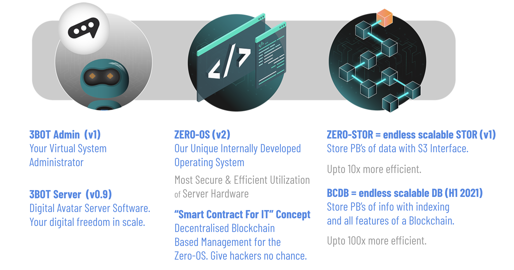

# Architecture

The architecture is built around a few essential and unique concepts. Capacity is managed in an autonomous way, and data is stored in a fully privacy respecting manner. 

The autonomy is brought by : 
- The __3Bot Admin__ is the Virtual System Administrator, managing your IT workloads, under your full control and only listening to the one owning the user’s individual private keys. It ensures an immutable record of any workload, which also enables the self-healing functionality as any workload can easily be restored if/when needed. With the 3Bot peer-to-peer architecture, everyone is equal, and no centralized institution nor big tech corporation can acquire control over one’s digital information or applications.

- The __3Bot Server__ is the back-end for your decentralized digital life. It creates a fully autonomous, self-sovereign identity, representing individuals in a digital world. 
Every citizen can have his own digital identity on the Threefold Grid. 
It enables individuals and organisations to remain in full control of personal __data__ of any kind. Social assets (identity documents, certificates, licenses, qualifications), verifiable credentials issued by an authority (diplomas, ...), personal digital data (pictures, videos, ...), but also permanent data streams like whereabouts (useful ex. for track-and-trace on Covid- 19). 
Next to that it is there to __run__ ANY type of __application__ under your control, for any type (personal or in interaction with peers). 

All runs on the decentralized cloud infrastructure, with 
- the __Zero-OS__ decentralized operating system. 

Storage is kept fully private and secure, with the help of 
- __ZERO-STOR__, an endlessly scalable storage solution for all your data in a private way, as data is dispersed intelligently over different nodes and different capacity owners. 
- __BCDB__ (BlockChain DataBase), an immutable, append-only database with indexing capabilities. Any workload is registered in an immutable way and enables the self-healing functionality as any workload can easily be restored if/when needed.